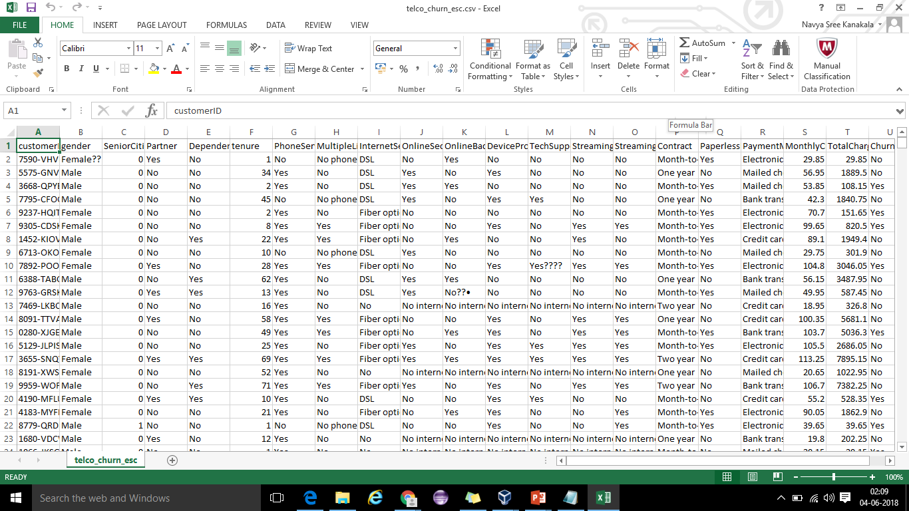
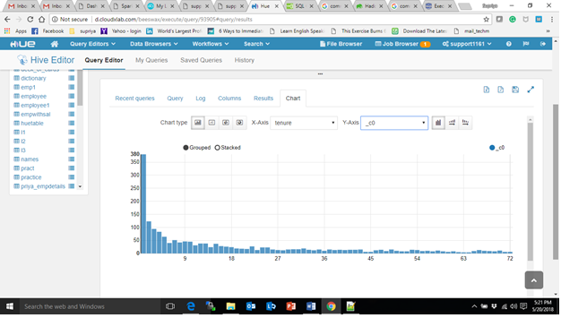
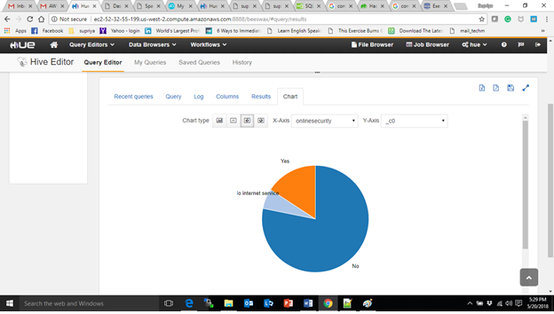
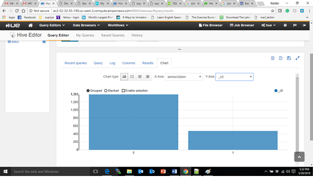
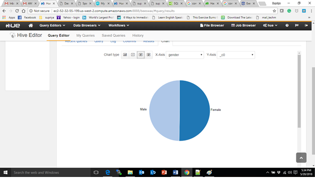
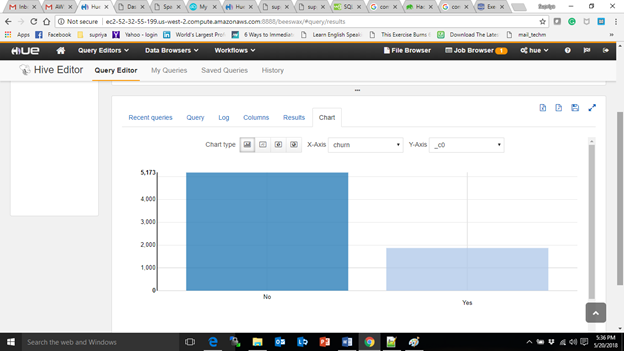

# pig-hive-hue
## Clean Telco dataset using Pig &amp; perform analysis using Hive

## Objective
Given an unclean telco dataset and our aim is to clean this dataset and store it in Hive to perform analysis

## Data description

1. Dataset is of Customer Churn data 

2. Consists information of CustomerID, gender, tenure, Senior citizens, contract
   
   
## Tools & Technologies used   

Best suited technologies:
1. Apache Pig

2. Apache Hive

3. HCatalog

4. Cloudera HUE

## Commands
   
1) To store cleaned dataset into hive, create a table telco in database telco_upx before running the pig script

    create table telco(customerID String,gender String,SeniorCitizen Int,Partner String,Dependents String,tenure Int,PhoneService String,MultipleLines String,InternetService String,OnlineSecurity String,OnlineBackup String,DeviceProtection String,TechSupport String,StreamingTV String,StreamingMovies String,Contract String,PaperlessBilling String,PaymentMethod String,MonthlyCharges Float,TotalCharges Float,Churn String) row format delimited fields terminated by ',' tblproperties ("skip.header.line.count"="1"); 

2) Create below pig script to clean and store into hive

$vi clean_and_store_in_hive.pig 

    junk_telco = LOAD 'telco_churn_esc.csv' USING org.apache.pig.piggybank.storage.CSVExcelStorage(',', 'NO_MULTILINE', 'NOCHANGE', 'SKIP_INPUT_HEADER'); 

    cleaned_telco = FOREACH junk_telco GENERATE REPLACE($0,'([^a-zA-Z0-9-.\\s]+)',''),REPLACE($1,'([^a-zA-Z0-9-.\\s]+)',''),REPLACE($2,'([^a-zA-Z0-9-.\\s]+)',''),REPLACE($3,'([^a-zA-Z0-9-.\\s]+)',''),REPLACE($4,'([^a-zA-Z0-9-.\\s]+)',''),REPLACE($5,'([^a-zA-Z0-9-.\\s]+)',''),REPLACE($6,'([^a-zA-Z0-9-.\\s]+)',''),REPLACE($7,'([^a-zA-Z0-9-.\\s]+)',''),REPLACE($8,'([^a-zA-Z0-9-.\\s]+)',''),REPLACE($9,'([^a-zA-Z0-9-.\\s]+)',''),REPLACE($10,'([^a-zA-Z0-9-.\\s]+)',''),REPLACE($11,'([^a-zA-Z0-9-.\\s]+)',''),REPLACE($12,'([^a-zA-Z0-9-.\\s]+)',''),REPLACE($13,'([^a-zA-Z0-9-.\\s]+)',''),REPLACE($14,'([^a-zA-Z0-9-.\\s]+)',''),REPLACE($15,'([^a-zA-Z0-9-.\\s]+)',''),REPLACE($16,'([^a-zA-Z0-9-.\\s]+)',''),REPLACE($17,'([^a-zA-Z0-9-.\\s]+)',''),REPLACE($18,'([^a-zA-Z0-9-.\\s]+)',''),REPLACE($19,'([^a-zA-Z0-9-.\\s]+)',''),REPLACE($20,'([^a-zA-Z0-9-.\\s]+)','');

    cleaned_telco1 = foreach cleaned_telco generate $0 as customerid,$1 as gender,(int)$2 as seniorcitizen,$3 as partner,$4 as dependents,(int)$5 as tenure,$6 as phoneservice,$7 as multiplelines,$8 as internetservice, $9 as onlinesecurity,$10 as onlinebackup, $11 as deviceprotection, $12 as techsupport, $13 as streamingtv, $14 as streamingmovies, $15 as contract, $16 as paperlessbilling, $17 as paymentmethod, (float)$18 as monthlycharges, (float)$19 as totalcharges, $20 as churn;

STORE cleaned_telco1 INTO 'telco_upx.telco' USING org.apache.hive.hcatalog.pig.HCatStorer();

3) Save and quit from vi editor

4) Run the script using below command 
   $pig -useHCatalog clean_and_store_in_hive.pig 
   
5) Perform below analysis in Hue so as to visualize the results    
 
   i.  How tenure of customers is effecting churn rate
   
       select count(churn),tenure from telco_upx.telco where churn == 'Yes' group by tenure;

   ii.  Analyze how online security provided by this company is effecting its churn rate 
        
	select count(churn),onlinesecurity from telco_upx.telco where churn == 'Yes' group by onlinesecurity;

   iii. Analyze the effect of senior citizens on churn rate 
        
	select count(churn),seniorcitizen from telco_upx.telco where churn == 'Yes' group by seniorcitizen;

   iv. Which gender is more likely to effect churn rate
       
       select count(churn),gender from telco_upx.telco where churn == 'Yes' group by gender;

   v. How many customers cancelled services offered by this company in the last month

       select count(churn),churn from telco_upx.telco group by churn;

   vi. Company waives off 10% for 1 year tenure customers, 20% for 2 year tenure customers and so on… 60% for 6 year tenure customers.          Calculate the new rates to be paid by these customers.
       
       select round(tenure/12) as year,monthlycharges,
       case when round(tenure/12) = 1 then 0.9*monthlycharges
       when round(tenure/12) = 2 then 0.8*monthlycharges
       when round(tenure/12) = 3 then 0.7*monthlycharges
       when round(tenure/12) = 4 then 0.6*monthlycharges
       when round(tenure/12) = 5 then 0.5*monthlycharges
       when round(tenure/12) >= 6 then 0.4*monthlycharges
       else monthlycharges end as amount_to_be_paid 
       from telco_upx.telco;

   vii. Statistics of number of customers according to their tenure 
        
	select round(tenure/12) as year,count(round(tenure/12)) from telco_upx.telco group by round(tenure/12);

   viii. Analyse how many customers are into paperless billing 
         
	 select paperlessbilling,count(paperlessbilling) from telco_upx.telco group by paperlessbilling;

   xi.   Analyze the type of internet service most preferred by senior citizens 
         
	 select COUNT(internetservice),internetservice from telco_upx.telco where seniorcitizen = 1 group by internetservice;

   x.a  which gender is more likely to watch movies,tv
       
        select gender,count(streamingtv) from telco_upx.telco group by gender;
       
   x.b  Which gender is more likely to watch tv 
       
        select gender,count(streamingmovies) from telco_upx.telco group by gender;

   xi. Analyze the preferred payment method of customers 
       
       select count(paymentmethod),paymentmethod from telco_upx.telco group by paymentmethod;

   xii. Analyze the most preferred payment method gender-wise 
        
	select gender,count(paymentmethod) from telco_upx.telco group by gender;

  xiii. Analyze the number of customers who are likely to make use of technical support provided by company 
        
	select count(techsupport) from telco where techsupport == 'Yes';
	
## Screenshots

1. select count(churn),tenure from telco_upx.telco where churn == 'Yes' group by tenure
   
   
   
2. select count(churn),onlinesecurity from telco_upx.telco where churn == 'Yes' group by onlinesecurity

   
   
3. select count(churn),seniorcitizen from telco_upx.telco where churn == 'Yes' group by seniorcitizen;

   
   
4. select count(churn),gender from telco_upx.telco where churn == 'Yes' group by gender;

   
   
5. select count(churn),churn from telco_upx.telco group by churn;

    
   
      
## Future Possibilities

As data is stored in Hive tables and Hive has SQL-like structure, we can explore it in 2 ways:

  1. Pulling data from Hive tables to Spark SQL using HiveContext
  
  2. Storing data of Hive tables to HDFS and then read stored HDFS data into Zeppelin using Spark   
